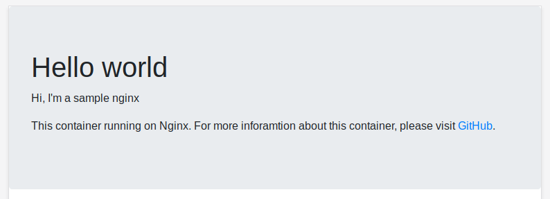

# Sample Nginx
The simple nginx instance to showing the static page for testing.



Execute command:
   ```bash
   docker run --rm --name sample-nginx -e TITLE="Hello World!" -e MSG="Hi, I'm a sample nginx" -p 8000:80 kensonman/sample-nginx
   ```
